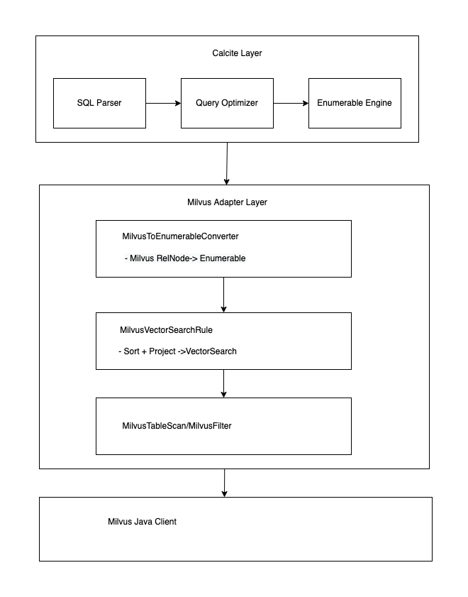

# Apache Calcite Milvus Adapter

Apache Calcite Milvus Adapter 是一个强大的向量数据库集成方案，它将 Milvus 向量搜索引擎与 Apache Calcite SQL 框架无缝结合，使得用户可以通过标准 SQL 语法执行高效的向量相似性搜索。

## 项目概述

通过构建 Calcite 适配器，将 Milvus 的向量检索能力整合到标准的 SQL 查询引擎中，实现了：

-  **SQL 接口**：使用标准 SQL 执行向量搜索
-  **查询优化**：Calcite 优化器智能下推向量操作
-  **多种度量方式**：支持欧氏距离、余弦相似度、内积等多种相似度算法的内置UDF

## 核心特性

### 1. 标准 SQL 向量查询
```sql
-- 向量相似性搜索
SELECT book_name, l2_distance(vector_field, [0.1,0.2, 0.3, 0.4]) d
FROM milvus.vector_table
Where book_name <> '小王子'
ORDER BY 2 LIMIT 5
```

### 2. 多种向量相似度度量
- **L2_DISTANCE**：欧氏距离（越小越相似）
- **COSINE_DISTANCE**：余弦距离
- **INNER_PRODUCT**：内积（越大越相似）

## 架构设计

### 整体架构



### 实现思路
目前已经实现 Milvus 表的Scan，Filter，Project算子，并封装了向量相似性检索的优化规则算子VectorSearch(Project+Sort)，且在calcite 中实现了计算向量距离的UDF函数（L2,IP,COSINE）。

整体思路如下：
保证sql功能完备：
目前最兜底的执行路径是Enumerable算子 + MilvusTableScan+向量检索UDF 在内存里面进行复杂查询：
- Join
- Union
- 子查询
- 向量数据库无法检索的向量操作（如求最不相似的topn向量）

查询加速：
- Filter 下推
现状：支持常用操作符下推， 目前不支持UDF下推 后续可能会支持一些简单的UDF，或者部分下推（应用范围待讨论，有可能会破坏后面的向量检索语义）
原因：传给Milvus 的过滤条件是字符串表达式，复杂的UDF难以转换成字符串表达式。后面可以推动社区SDK 支持树状的谓词结构支持更加细粒度的查询

- Project 下推
现状：支持project列表是常量和表字段的下推

- 向量检索下推 （Sort + Project）
现状：
- 已经实现 MilvusVectorSearchRule :当 Sort + Limit 命中 Project的向量距离函数即可转换为 MilvusVectorSearch 节点，即可将向量检索下推到 Milvus 端执行（求最相似的top n向量）
为保证查询正确性，规则会验证排序方向：

```java
// L2 距离：ASC（越小越相似）
L2_DISTANCE → ASC

// 内积和余弦：DESC（越大越相似）
INNER_PRODUCT → DESC
COSINE_DISTANCE → DESC
```

这里需要考虑的点： milvus project 下推 除了支持表字段和常量外，如果想要包函向量距离函数的project 下推，依赖sort 是否命中该project的向量距离函数，但是project 无法 访问sort 的信息，
因为project 是sort 的子节点，所以只能通过规则去匹配转换。


#### 1. **MilvusRel** (Relational Expression)
定义 Milvus 约定的关系表达式接口，继承自 `Convention`。

#### 2. **MilvusTableScan**
表示对 Milvus 集合的数据扫描操作，支持：
- 基本字段扫描

#### 3. **MilvusVectorSearch**
封装完整的向量搜索操作，包含：
- 向量字段
- 查询向量
- 相似度度量类型
- 过滤条件
- 投影信息

#### 4. **MilvusVectorSearchRule**
**核心优化规则**，将 `Sort → Project → Filter->Scan` 模式转换为 `MilvusVectorSearch`：
- 检测 ORDER BY 中的向量函数
- 验证排序方向与函数类型匹配
- 下推 LIMIT 作为 Top-K
- 合并过滤条件

#### 5. **MilvusToEnumerableConverter**
将 Milvus RelNode 转换为 Enumerable（可枚举）形式，生成执行代码：
- 构建运行时向量搜索参数
- 生成 `table.vectorSearch()`，`table.scan()` 方法调用
- 处理结果投影

## 使用示例

### 示例 1：基本向量搜索
```sql
-- 查找最相似的 10 个文档
SELECT id, title, L2_DISTANCE(embedding, ARRAY[0.1, 0.2, 0.3, ...]) as dist
FROM articles
ORDER BY dist ASC
LIMIT 10
```

### 示例 2：混合查询（向量 + 标量过滤）
```sql
-- 在特定类别中搜索
SELECT id, text, COSINE_DISTANCE(vector, QUERY_VECTOR('[...]')) as similarity
FROM documents
WHERE category = 'machine_learning' AND publish_year > 2020
ORDER BY similarity DESC
LIMIT 20
```

### 示例 3：只返回分数
```sql
-- 只返回最相似文档的 ID 和分数
SELECT id, INNER_PRODUCT(feature, ARRAY[...]) as score
FROM products
ORDER BY score DESC
LIMIT 5
```


## 项目结构

```
milvus/
├── src/main/java/org/apache/calcite/adapter/milvus/
│   ├── convention/
│   │   ├── MilvusRel.java                    # 约定接口
│   │   ├── MilvusToEnumerableConverter.java  # 转换器
│   │   └── MilvusToEnumerableConverterRule.java
│   ├──
│   ├── factory/
│   │   └── MilvusTranslatableTable.java      # 表接口
│   ├── operation/
│   │   ├── MilvusEnumerator.java             # 基础枚举器
│   │   ├── MilvusFilter.java
│   │   ├── MilvusProject.java
│   │   ├── MilvusTableScan.java
│   │   ├── MilvusVectorEnumerator.java       # 向量搜索枚举器
│   │   ├── MilvusVectorSearch.java           # 向量搜索 RelNode
│   │   ├── MilvusVectorSearchRule.java       # 核心优化规则
│   │   ├── VectorSearchParam.java            # 搜索参数
│   │   └── VectorSearchHint.java             # Hint 支持
│   ├── udf/
│   │   └── MilvusVectorUdfs.java             # 向量函数定义
│   └── util/
│       ├── MilvusFilterTranslator.java
│       ├── MilvusProjectExpression.java      # 投影表达式
│       ├── MilvusProjectUtil.java
│       └── VectorLogicExtractor.java         # 向量提取工具
└── src/test/
    └── java/org/apache/calcite/adapter/milvus/
        └── sql/
            └── MilvusVectorSearchTest.java   # 集成测试
```
